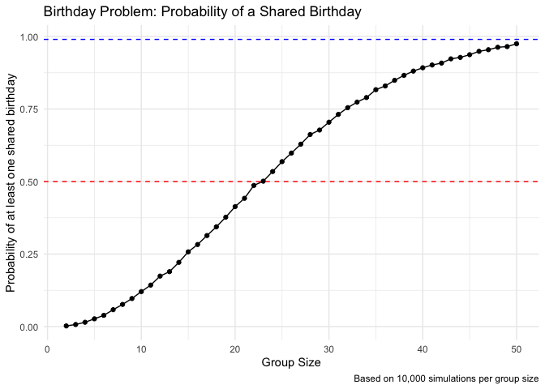

p8105_hw5_mk5149
================
Mungyu Kwok
2025-11-05

# Preparation

Load any necessary packages.

``` r
library(tidyverse)
```

    ## ── Attaching core tidyverse packages ──────────────────────── tidyverse 2.0.0 ──
    ## ✔ dplyr     1.1.4     ✔ readr     2.1.5
    ## ✔ forcats   1.0.0     ✔ stringr   1.5.1
    ## ✔ ggplot2   3.5.2     ✔ tibble    3.3.0
    ## ✔ lubridate 1.9.4     ✔ tidyr     1.3.1
    ## ✔ purrr     1.1.0     
    ## ── Conflicts ────────────────────────────────────────── tidyverse_conflicts() ──
    ## ✖ dplyr::filter() masks stats::filter()
    ## ✖ dplyr::lag()    masks stats::lag()
    ## ℹ Use the conflicted package (<http://conflicted.r-lib.org/>) to force all conflicts to become errors

# Problem 1

We set a random seed to ensure our simulation results are reproducible.

``` r
set.seed(42) # Set seed for reproducible results
```

This function `bday_sim` takes a group size `n_room` as input, samples
`n_room` birthdays from 1 to 365, and returns `TRUE` if a duplicate
birthday is found and `FALSE` otherwise.

``` r
bday_sim = function(n_room){
  # Sample n_room birthdays from 1:365 with replacement
  birthdays = sample(1:365, n_room, replace = TRUE)
  
  # Check if the number of unique birthdays is less than the group size
  # If it is, a duplicate must exist.
  repeated_bday = length(unique(birthdays)) < n_room
  
  # Return the logical result
  repeated_bday
}
```

Now, we run the simulation. We need to run it 10,000 times for each
group size between 2 and 50.

We use `expand_grid` to create a tibble (a data frame) with every
combination of group_size (from 2 to 50) and iter (from 1 to 10,000).

We then mutate a new column `has_duplicate` by applying our `bday_sim`
function to each g`roup_size` value using `map_lgl`.

Finally, we `group_by(group_size)` and summarize to calculate the
probability by taking the `mean()` of the logical `has_duplicate` column
(where TRUE = 1 and FALSE = 0).

``` r
# Define simulation parameters
n_sims = 10000
group_sizes = 2:50

# Create a tibble with all combinations of group sizes and iterations
sim_grid = 
  expand_grid(
    group_size = group_sizes,
    iter = 1:n_sims
  )

# Run the simulation and calculate probabilities
bday_sim_results = 
  sim_grid |>
  mutate(
    # Apply the simulation function to each group_size value
    has_duplicate = map_lgl(group_size, bday_sim)
  ) |>
  group_by(
    group_size
  ) |>
  summarize(
    # The mean of TRUE/FALSE values gives the probability
    probability = mean(has_duplicate)
  )

# View the first few rows of the result
knitr::kable(head(bday_sim_results))
```

| group_size | probability |
|-----------:|------------:|
|          2 |      0.0023 |
|          3 |      0.0072 |
|          4 |      0.0149 |
|          5 |      0.0268 |
|          6 |      0.0388 |
|          7 |      0.0582 |

Finally, we create a plot of the probability as a function of group
size.

``` r
bday_sim_results |>
  ggplot(aes(x = group_size, y = probability)) +
  geom_point() +
  geom_line() +
  labs(
    title = "Birthday Problem: Probability of a Shared Birthday",
    x = "Group Size",
    y = "Probability of at least one shared birthday",
    caption = "Based on 10,000 simulations per group size"
  ) +
  theme_minimal() +
  # Add horizontal lines for reference
  geom_hline(yintercept = 0.5, linetype = "dashed", color = "red") +
  geom_hline(yintercept = 0.99, linetype = "dashed", color = "blue")
```

<!-- --> The
plot shows the probability of a shared birthday as a function of the
group size. The probability starts near 0 for a small group (e.g., at
`n = 2`, the probability is 1/365, or ~0.0027) and increases rapidly as
the group size grows.

The plot shows:

- The probability crosses 50% (the red dashed line) with a group size of
  just 23 people.

- The probability is already ~97% by the time the group size reaches 50.

- The probability crosses 99% (the blue dashed line) with a group size
  of 57 (which is outside our simulation range but visible on the
  trend).
